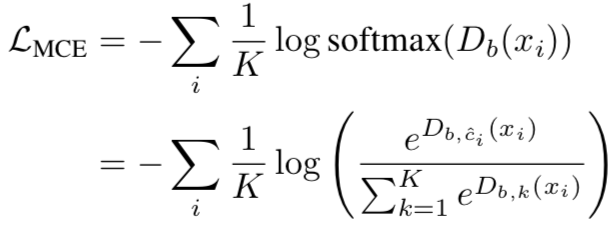
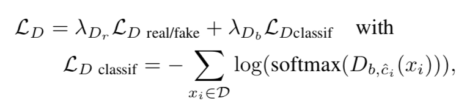

# Creativity in Generative Adversarial Networks
### SEMESTER PROJECT REPORT/README
* Güneş Yurdakul - Sciper No: 298878
* Prof. Alexander Alahi
* Advisor: Liu Yuejiang 

1. [ Introduction](#intro)
2. [ Experiments and Usage](#exp)
    1. [Our Aim](#2.1)
    2. [DesIGN: Design Inspiration from Generative Networks ](#2.2)
    3. [CGAN](#2.3)
    4. [InfoGAN](#2.4)
    5. [Variational Autoencoders ](#2.5)
    6. [FIGR: Few-shot Image Generation with Reptile](#2.6)
4. [ Conclusion](#conclusion)
4. [ References](#ref)

## 1. Introduction

Generative models such as GANs[1] and Variational Auto-encoders[2] have increased the capability of creating models which can generate and manipulate visually realistic images. These models are extremely successful if there exists an excessive amount of training data. The problem is, if the generated samples are able to model the true data distribution. Since GANs are likely suffer from mode collapse, the generations are usually very similar to real images or generators are smoothly interpolating between training samples.  
The aim of our research is explore the creativity of the generated images and finding a way to generate novel and creative images. Since humans can easily generalize from very few examples, we have experimented with various types of GANs and VAEs in zero-shot and few shot settings.
Additionally, we believe that meta-learning, also known as ‘learning to learn’ should also be explored in generative models to improve few-shot generations. Meta-learning models should be able to generalize to new tasks during test time by just a limited number of exposure to a new samples of a new task. A new paper [7], presents some promising results of their new model Few-shot Image Generation using Reptile (FIGR). Their work demonstrates the potential of meta-learning to train generative models for few-shot generation and to generate novelty.
We believe that being able to generate images using just a few samples will be very beneficial in other ML related tasks where there is not enough number of training data. For example a dataset containing car accidents will not include many samples in calm neighborhoods. Few shot image generation will be very useful in cases where data augmentation is required.

## 2. Experiments and Usage

### 2.1. Our Aim

We want to be able to generate samples in zero shot and/or few shot settings by manipulating latent features of generative models. 

 

### 2.2. DesIGN: Design Inspiration from Generative Networks 
We started our research with  DesIGN: Design Inspiration from Generative Networks paper [3], which is a very recent paper published by Facebook AI Research Team. The aim of the paper is to create creative and visually appealing fashion designs such as bags, t-shirts etc. using Generative Adverserial Networks. They use DCGAN architecture[4] is used and they propose two new loss functions classification loss and creativity loss.  

Their creativity loss basically computes the Multi Class Cross Entropy(MCE) loss between the class prediction of the dis- criminator and the uniform distribution. The aim is to encourage deviation from existing classes such as shapes and textures in this paper.  

#### Required Packages
* Tensorflow [6]
* Numpy
* Matplotlib

#### Usage
You can run the code using STYLEGAN architecture with 8 Gaussians dataset(default) using the code below:  

    $ cd 2D-codes
    $ python3 STYLEGAN.py --fig_name GAN_deneme --label  --notebook --lambda_g 0 --lambda_d 0 --missing_mixt 1
For different settings you can type:
    
    $ python3 STYLEGAN.py --help
    
#### Toy Dataset Results and Drawbacks
We wanted to observe how their algorithm will work using a toy dataset with 2 features (8 Gaussians). We did some experiments by removing samples of one or more labels. We were curious if the generated samples will be close to the removed samples.  
However, our results have showed that although some of the generated samples were inbetween gaussian mixtures of given training samples, none of the generated samples were anywhere close to the missing label. Additionally, their creativity evaluation metric can be very subjective, since they are mainly using a human evaluation(survey).They claim that Mean nearest neighbors distance score is used to evaluate creativity, but it is a very vague method, since if the samples are too close to the real samples then it means there is almost no creativity and if they are too far the generated samples might look unrealistic.  
  

### 2.3. CGAN

We have experimented with CGAN [5] using 8 Gaussians dataset. Since the generated samples are conditioned on labels and we have thought the latent space could represent the angle and distance to the center point, we were expecting to see some generated samples to be from the same distribution of missing label. However, the results were not as we expected. We were only able to generate samples from existing classes. 

 

#### Required Packages
* Tensorflow [6]
* Numpy
* Matplotlib
* seaborn

#### Usage
Simple CGAN model with 8 Gaussians dataset(default) can be run using the code below:

    $ cd 2D-codes
    $ python CGAN.py --fig_name result_file_name --label --notebook --missing_mixt 4

For different settings you can type:
    
    $ python3 CGAN.py --help

  
### 2.4. InfoGAN

InfoGAN [7] splits the Generator input to a noise vector and a latent vector. The aim is to maximize the Mutual Information between the code and the generator output.  

 
Simple InfoGAN model with 8 Gaussians dataset(default) can be run using the code below:
    
    $ cd infoGAN
    $ python3 main.py --gan_type infoGAN --dataset mnist --missing_mixt 3

For different settings you can type:
    
    $ python3 main.py --help

We played with the latent feature vectors:

### 2.5. Variational Autoencoders (VAEs)
We decided to experiment with VAEs as well. Manipulating the latent feature vectors of VAEs works well compared to AEs, since their latent spaces are continuous and therefore lets us to easily do random sampling and interpolation[2]. 

#### Required Packages
* Torch
* Torchvision
* Numpy
* Matplotlib
* ggplot
* sklearn

#### Usage

VAE model with fashion-mnist dataset(default) can be run using the code below:

    $ cd vae
    $  python3 VAE.py --dataset fashion-mnist --encoding-vector-size 2 --remove-label 3 --few-shot 4 

For different settings you can type:
    
    $ python3 VAE.py --dataset fashion-mnist --encoding-vector-size 2 --remove-label 4
    
* --remove-label will choose the label to remove or sample few-shots from the training set (int)
* --few-shot sets the number of shots in few-shot setting, but to use this setting --removel-label should also be set.
* By using --dataset option, you can select any of 'mnist', 'bags','fashion-mnist','8Gaussians', 'cifar10', 'cifar100', 'svhn', 'stl10', 'lsun-bed' datasets. 

 

The generated samples if we remove the samples of trouser class can be seen below. Encoding vector has size 2, so you can clearly see the interpolation. In this model, we can't see any trouser sample in generated samples as expected.  

  

However, when we removed sneakers class the interpolation gives better results. Since sneakers are shoes which are shorter than boots and longer than sandals, we were able to generate a lot of samples which look like sneakers.  

### 2.6. FIGR: Few-shot Image Generation with Reptile
FIGR [8] is a GAN model which is  meta-trained with Reptile[9]. This paper has shown its a potential in recent years since good meta-learning models are able to generalize to new tasks during test time by just a limited number of exposure to a new samples of a new task.  

#### Required Packages
    $ git clone https://github.com/OctThe16th/FIGR.git
    $ cd FIGR
    $ pip install -r requirements.txt
    
You can download their code and replace their train.py file with function with the train.py file under my FIGR folder.
#### Usage
    $ python train.py --dataset Mnist & tensorboard --logdir Runs/
    
For different settings you can type:
    
    $ python train.py --help

The architecture presented in the paper takes about 125 hours to train eveon on a 125 hours Tesla V100 on Google Cloud Platform (GCP). Their model is computationally very expensive since they are using Wasserstein Loss [10] with Gradient Penalty  and also Residual neural networks. I used the code they provided but removed wasser stein loss and used DCGAN.  
They use human evaluation to test if the image scan fool the can fool human judges. However, they present no evaluation result on novelty or creativity of created images. 
Their result can be seen below. Since training takes a lot of time, I used the image on the paper.

 
In few shot setting results, the generated samples seem to be almost the copies of the given 4 samples. There is not much diversity in generations. 

After observing this, we decided to test if even a very simple VAE with 3 latent features in the encoded vector could generate more diversity among generated samples in one-shot and few-shot settings. 

We added the same trouser sample is added to our zero-shot dataset as many times so that almost same number of samples from each class exists. 
As you can see even a simple VAE which has only seen one sample of a trouser is able to generate trousers with different widths and shades. 

We added the same 4 samples to the dataset as many times so that almost same number of samples from each class exists. As in their example, our simple VAE has only seen four types of samples of digit '9' and it is able to generate more creative samples than their result. 

## 3. Conclusion
We explored the latent space on both synthetic data(8 Gaussians) and images. Meta-Learning has promising results on generalizing on new samples and learning key features of the images very quickly during fine-tuning. However it is still computationally very expensive and generated samples lack novelty and creativity. Finally, how to evaluate creativity is still unclear and there is no consensus in the field about how to define creativity and how to evaluate it.
 

## References
[1] Goodfellow, I., Pouget-Abadie, J., Mirza, M., Xu, B., Warde-Farley, D., Ozair, S., ... & Bengio, Y. (2014). Generative adversarial nets. In Advances in neural information processing systems (pp. 2672-2680). 
[2] Kingma, D. P., & Welling, M. (2013). Auto-encoding variational bayes. arXiv preprint arXiv:1312.6114. 
[3] Sbai, O., Elhoseiny, M., Bordes, A., LeCun, Y., & Couprie, C. (2018). Design: Design inspiration from generative networks. In Proceedings of the European Conference on Computer Vision (ECCV) (pp. 0-0). 
[4] Radford, A., Metz, L., & Chintala, S. (2015). Unsupervised representation learning with deep convolutional generative adversarial networks. arXiv preprint arXiv:1511.06434. 
[5] Mirza, M., & Osindero, S. (2014). Conditional generative adversarial nets. arXiv preprint arXiv:1411.1784.
[6] Abadi, M., Barham, P., Chen, J., Chen, Z., Davis, A., Dean, J., ... & Kudlur, M. (2016). Tensorflow: A system for large-scale machine learning. In 12th {USENIX} Symposium on Operating Systems Design and Implementation ({OSDI} 16) (pp. 265-283).
[7] Chen, X., Duan, Y., Houthooft, R., Schulman, J., Sutskever, I., & Abbeel, P. (2016). Infogan: Interpretable representation learning by information maximizing generative adversarial nets. In Advances in neu 
[8] Clouâtre, L., & Demers, M. (2019). FIGR: Few-shot Image Generation with Reptile. arXiv preprint arXiv:1901.02199. 
[9] Nichol, A., Achiam, J., & Schulman, J. (2018). On first-order meta-learning algorithms. arXiv preprint arXiv:1803.02999. 
[10] Arjovsky, M., Chintala, S., & Bottou, L. (2017, July). Wasserstein generative adversarial networks. In International Conference on Machine Learning (pp. 214-223). 

## Acknowledgements
InfoGAN implementation has been based on nxlwm/pytorch-generative-model-collections.
VAE implementation has been based on pytorch/examples.
Both models tested with Pytorch 1.0.1 on macOSMojave Version 10.14 16.04.

